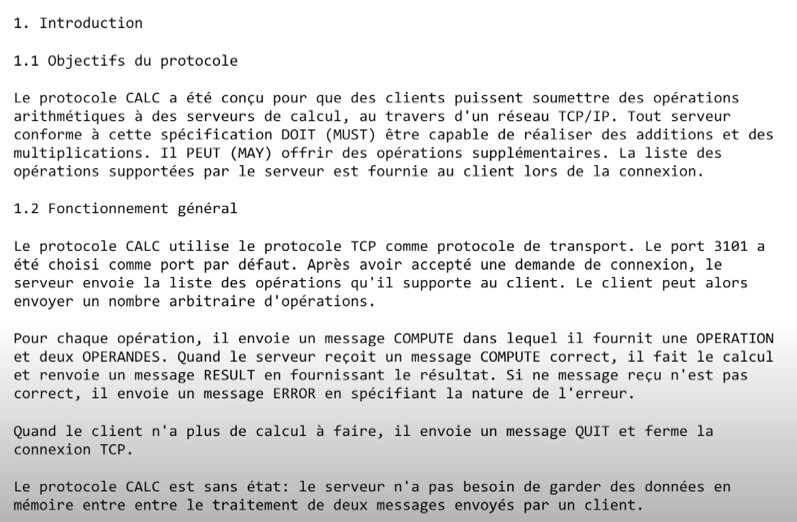
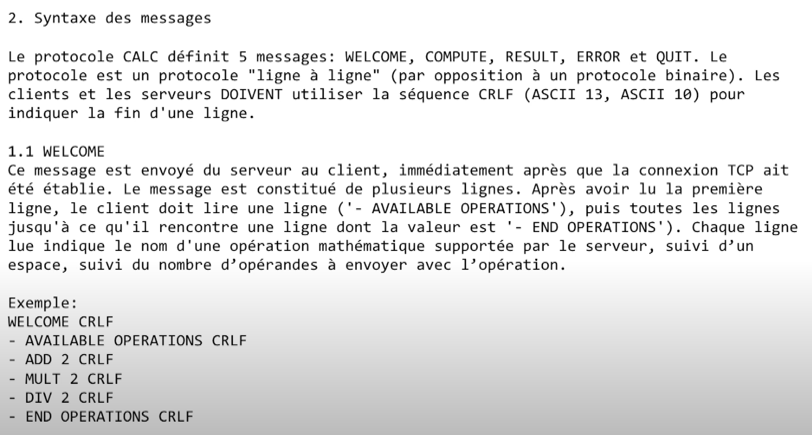
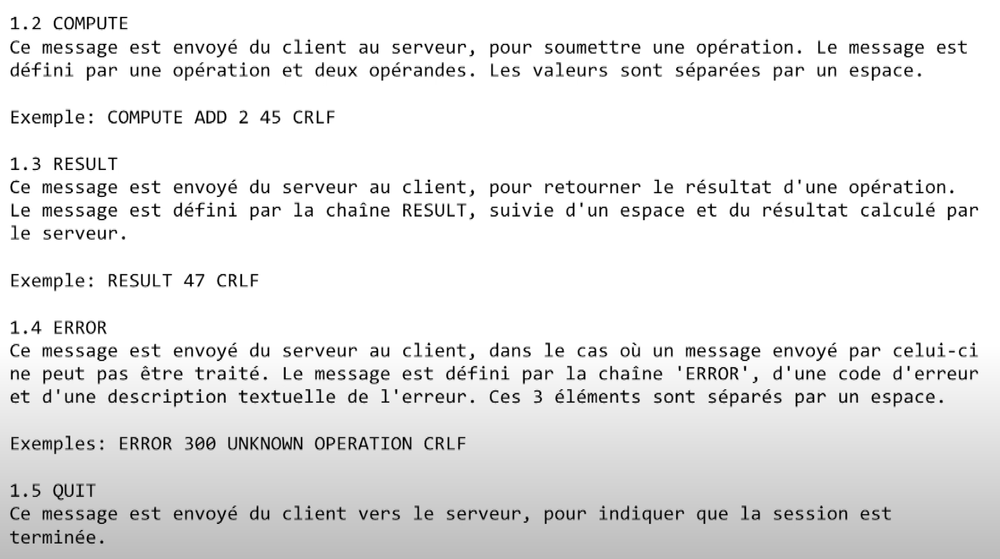
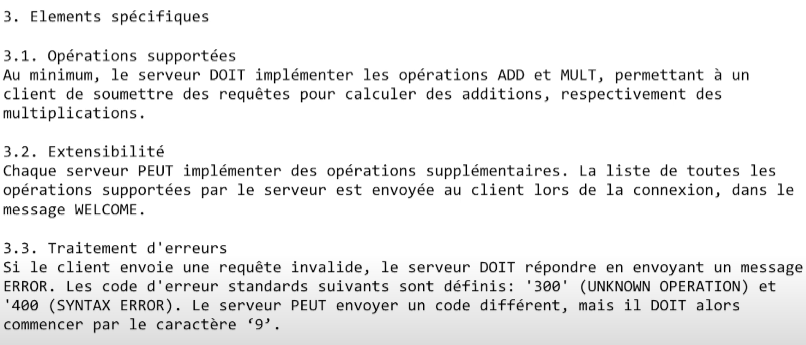
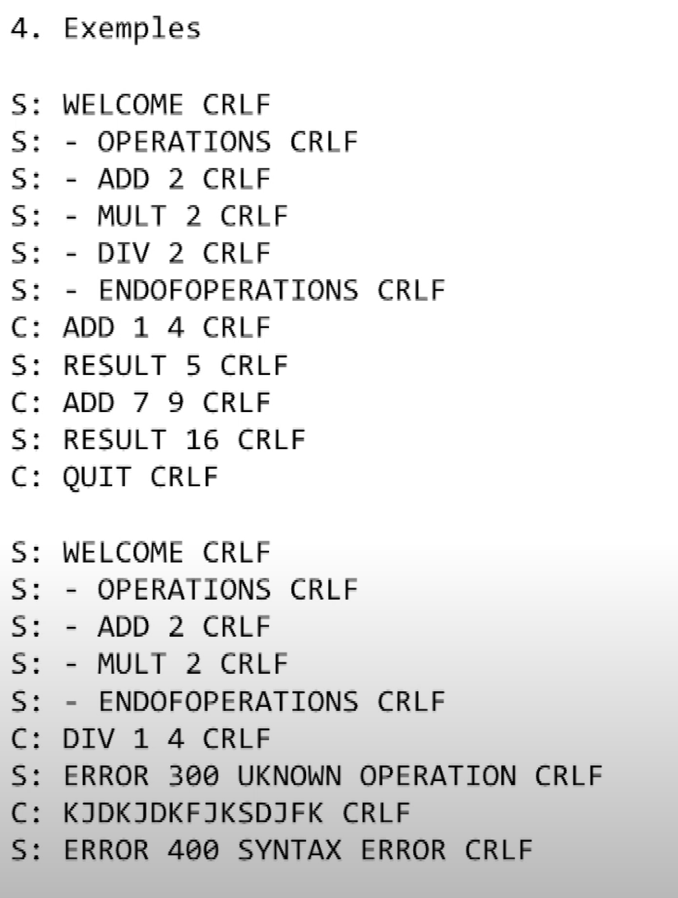

# Ian

## Questions:

* Protocol objectives: what does the protocol do?
  
  -> Establish the communication between the client and the server.

* Overall behavior:
    * What transport protocol do we use?  

      -> TCP

    * How does the client find the server (addresses and ports)?

      -> It is hosted in local

    * Who speaks first?

      -> Client

    * Who closes the connection and when?

      -> Client, when he is DONE

* Messages:
    * What is the syntax of the messages?

      -> each message represent the push of a button from the user on the calculator

    * What is the sequence of messages exchanged by the client and the server? (flow)

      -> requète réponse ? (avec syn synack ack kacke)

    * What happens when a message is received from the other party? (semantics)

      -> it is processed, put in a buffer

* Specific elements (if useful)
    * Supported operations

      -> client send    : digit, operation (=, +, -, *, /, del, reset, end)

      -> client recieve : result string

      -> server recieve : digit, operation

      -> server send    : result string

* Error handling

  -> processed by the server, messages the client

  * Extensibility

  -> other op, full string process, 

* Examples: examples of some typical dialogs.

**>** is server, **$** is client

````
$ 2
$ +
$ 4
$ 0
$ =
> 42
````


# Leichti










